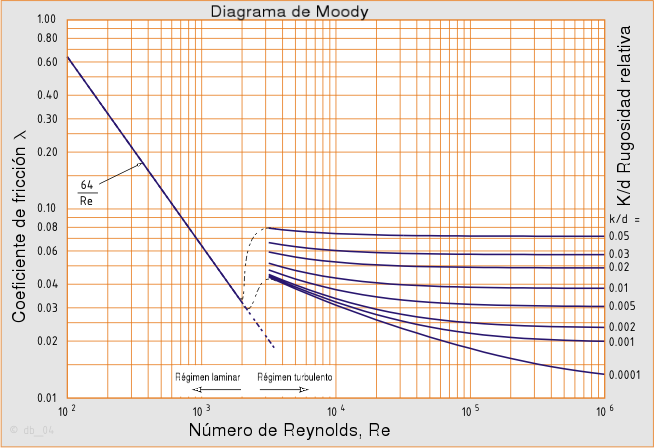
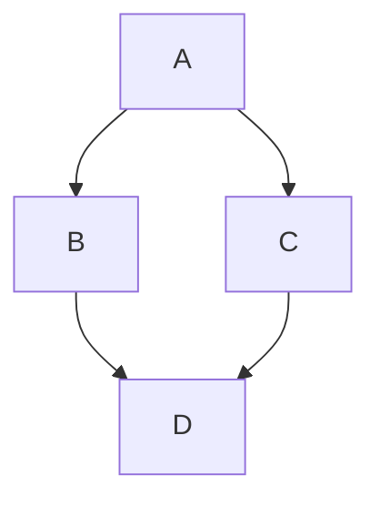

# Tarea "Aprender Classroom 50 y Markdown" 


## Enlaces 

 - [Mi página en el campus](https://espaciosvirtuales.uhu.es/user/view.php?id=118373&course=4685)
 - [Mi página de perfil](https://github.com/) en GitHub
 - [La organización GitHub que he creado](https://github.com/UHU-FPDU-GDI-2026/)
 - [El Classroom 50 que he creado](https://classroom50.org/UHU-FPDU-GDI-2026/uhu-fpdu-gdi)

### Cita favorita:

> Mira ese punto. Eso es aquí. Eso es casa. Eso somos nosotros. En él, todos los que amas, todos los que conoces, todos de quienes has oído hablar, todos los seres humanos que han existido, vivieron sus vidas. El conjunto de nuestras alegrías y sufrimientos, miles de religiones, ideologías y doctrinas económicas convincentes, cada cazador y recolector, cada héroe y cobarde, cada creador y destructor de civilizaciones, cada rey y campesino, cada joven pareja enamorada, cada madre y padre, cada niño esperanzado, cada inventor y explorador, cada maestro de moral, cada político corrupto, cada "superestrella", cada "líder supremo", cada santo y pecador en la historia de nuestra especie, vivieron ahí, en una mota de polvo suspendida en un rayo de sol.
>
> La Tierra es un escenario muy pequeño en una vasta arena cósmica. Piensa en los ríos de sangre derramados por todos esos generales y emperadores para que, en gloria y triunfo, pudieran convertirse en amos momentáneos de una fracción de un punto. Piensa en las crueldades infinitas visitadas por los habitantes de un rincón de este píxel sobre los apenas distinguibles habitantes de algún otro rincón, cuán frecuentes son sus malentendidos, cuán ansiosos están de matarse unos a otros, cuán fervientes son sus odios.
>
> Nuestras posturas, nuestra imaginada importancia, la ilusión de que tenemos alguna posición privilegiada en el Universo, son desafiadas por este punto de luz pálida. Nuestro planeta es una mota solitaria en la gran oscuridad cósmica que nos envuelve. En nuestra oscuridad, en toda esta vastedad, no hay ni un indicio de que la ayuda vaya a venir de otro lugar para salvarnos de nosotros mismos.
>
> La Tierra es el único mundo conocido hasta ahora que alberga vida. No hay ningún otro lugar, al menos en el futuro cercano, al que nuestra especie pueda migrar. Visitar, sí. Establecerse, todavía no. Nos guste o no, por el momento la Tierra es donde hacemos nuestra posición.
>
> Se ha dicho que la astronomía es una experiencia humillante y formadora de carácter. Quizá no haya mejor demostración de la locura de las presunciones humanas que esta imagen distante de nuestro pequeño mundo. Para mí, subraya nuestra responsabilidad de tratarnos unos a otros con más bondad, y de preservar y cuidar el punto azul pálido, el único hogar que hemos conocido .


<div align="right">Carl Sagan 1994</div>


### Pequeño fragmento de código:

```c
if(sad()==true) {
  sad().stop();
  behappy();
}
```

---
### Enlaces de contacto:

|:loudspeaker:|Redes sociales|
|-|-|
|[](https://mobile.twitter.com/hectorarteagama/)|@hectorarteagama|

---

### Lista de tareas Aprendizaje y Enseñanza de la Tecnología:
- [x] Registrarse en GitHub.
    - [x] Registrarse en GitHub.
    - [x] Pedir descuentos.

<br>

- [ ] Aprender Markdown.
    - [x] Incluir imagen.
    - [x] Incluir alguna lista.
    - [x] Incluir una cita favorita.
    - [x] Incluir una tabla.
    - [x] Incluir un emoji.
    - [x] Incluir una imagen-enlace.
    - [ ] Incluir una fórmula matemática escrita en LATEX.


### Expresión matemática. Ecuación de Colebrook-White:

<br>

$${1 \over \sqrt{f}}=-2·log{({k/D \over 3.71}+{2.51 \over Re·\sqrt{f}})}$$

<br>
<br>

### Otra forma de determinar f:
<br>

<!-- No podía centrar la imagen simplemente añadiendo atributos como , así que creo un párrafo centrado con <p align="center"> y luego pongo la imagen dentro -->

<p align="center">

</p>


### Diagramas con MERMAID

Usando el siguiente cógido podemos introducir un diagrama:

<!--Doble sangrado para que aparezca VERBATIM, es decir LITERAL-->

    ```mermaid
    graph TD;
    A-->B;
    A-->C;
    B-->D;
    C-->D;
    ```


